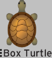
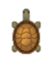
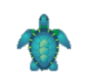
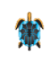
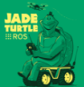

# 2.1 ROS概述

#### 2.1.1 ROS简介

从1959 年，美国 UNIMATION 公司生产出世界上第一台工业机器人到现如今，随着计算机技术、传感技术、硬件技术等新型技术的发展，机器人行业发展蒸蒸日上。当前机器人主要分为工业机器人和服务机器人两种。工业机器人主要面向的是工业领域，它主要依靠自身动力和控制能力来实现各种功能。此外它还可以在人指挥下从事相关动作，也可以按照预先编排的程序运行，现代的工业机器人还可以根据人工智能技术制定的原则纲领行动。服务机器人指的是除工业自动化应用以外，能完成对于人类或其他设备有用的任务的机器人。定义是略显抽象的，直观的说工业机器人就是各种机械臂，我们也常称作工业机械臂；平常生活中能见到的移动机器人，都属于服务机器人。比较特殊的就是专业领域的服务机器人还包括手术机器人等，而军用的移动机器人则属于特种机器人。由于移动服务机器人的复杂性，直到ROS的出现，极大增强了编程的模块化与代码复用，降低了开发难度，服务机器人才有了长足发展。

.png>)

**2.1.2 ROS发展历史**

我们首先简单了解一下ROS的历史。

随着机器人技术的快速发展，机器人平台的搭建也越发多样化，人们对开源代码的复用性和模块化的需求也越来越强烈，但是原有的机器人系统又不能很好的满足人们对代码复用性和模块化的需求。面对这样的挑战，世界各地的优秀开发者与团队纷纷加入到机器人通用软件框架的研发工作中。2010年Willow Garage 公司发布了开源机器人操作系统ROS，ROS全称Robot Operating System，是一个广泛应用于机器人系统的架构软件。ROS的最大方便之处在于无需改动代码就可以使用于各种机器人上。

ROS操作系统最初的出现是在2007年斯坦福大学人工智能实验室的项目与机器人公司（Willow Garage）合作的个人机器人项目（Personal Robots Program）上，2008年以后就由Willow Garage来维护，2010年由Willow Garage公司正式发布 。ROS大致每年发布一个版本，目前比较普及的ROS版本包括indigo、jade、kinetic、melodic，一些早期版本现在已经停止维护。ROS的版本更新与Linux的发行版更新步调一致，这样可以使得ROS的功能包在稳定的代码基础上改善。

<table data-header-hidden><thead><tr><th></th><th width="200"></th><th></th><th></th><th></th></tr></thead><tbody><tr><td>发行版本</td><td>
支持（结束支持）

日期
</td><td>海报</td><td>海龟形态</td><td>备注</td></tr><tr><td><a href="http://wiki.ros.org/boxturtle">ROS Box Turtle</a></td><td>
2010.3.2

-
</td><td></td><td></td><td>
首次支持Ubuntu

（8.04、8.10、9.04

9.10）；Python 2.5

C++03；Boost 1.37

Lisp SBCL 1.0.38

<strong>以下版本未变换的不列出</strong>
</td></tr><tr><td><a href="http://wiki.ros.org/cturtle">ROS C Turtle</a></td><td>
2010.8.2

-
</td><td></td><td></td><td>
支持Ubuntu（9.04、9.10、

10.4、10.10）
</td></tr><tr><td><a href="http://wiki.ros.org/diamondback">ROS Diamondback</a></td><td>
2011.3.2

-
</td><td></td><td></td><td>
支持Ubuntu（10.04、10.10

、11.04）

Python 2.6 ；Boost 1.40
</td></tr><tr><td><a href="http://wiki.ros.org/electric">ROS Electric Emys</a></td><td>
2011.8.30

-
</td><td></td><td></td><td>
支持Ubuntu（10.04、10.10

、11.04、11.10）

Lisp SBCL 1.0.x
</td></tr><tr><td><a href="http://wiki.ros.org/fuerte">ROS Fuerte Turtle</a></td><td>
2012.4.23

-
</td><td></td><td></td><td>
支持Ubuntu（10.04、11.10

、12.04）

首次介绍了catkin的第一个版本
</td></tr><tr><td><a href="http://wiki.ros.org/groovy">ROS Groovy Galapagos</a></td><td>
2012.12.31

2014.7
</td><td></td><td></td><td>
支持Ubuntu（11.10、12.04

、12.10）；CMake 2.8.3

Boost 1.46；Python 2.7

Catkin被正式采用
</td></tr><tr><td><a href="http://wiki.ros.org/hydro">ROS Hydro Medusa</a></td><td>
2013.9.4

2015.5
</td><td></td><td></td><td>
支持Ubuntu（12.04、12.10

、13.04）；Boost 1.48

支持释放、集成和测试
</td></tr><tr><td><a href="http://wiki.ros.org/indigo">ROS Indigo Igloo</a></td><td>
2014.7.22

2019.4
</td><td></td><td></td><td>
支持Ubuntu（13.10、14.04）

Boost 1.53；CMake 2.8.11

加入了Python3.3

Catkin:源编译、二进制包、

Wiki、持续集成

Rosbuild：源编译
</td></tr><tr><td><a href="http://wiki.ros.org/jade">ROS Jade Turtle</a></td><td>
2015.5.23

2017.5
</td><td></td><td></td><td>
支持Ubuntu（14.04、14.10

、15.04）

Boost 1.54；CMake 2.8.12

Lisp SBCL 1.1.14

加入Gazebo5、Ogre3D 1.8x、PCL1.7x、

OpenCV2.4.x
</td></tr><tr><td><a href="http://wiki.ros.org/kinetic">ROS Kinetic Kame</a></td><td>
2016.5.23

2021.4
</td><td></td><td></td><td>
支持Ubuntu（15.10、16.04）

C++11，Python3.4（建议），

Lisp SBCL 1.2.4；Cmake 3.0.2

Boost 1.55

Ogre3D 1.9.x；Qt 5.3.x

Gazebo 7；OpenCV 3.x

PyQt5 支持amd64 arm32

arm64
</td></tr><tr><td><a href="http://wiki.ros.org/lunar">ROS Lunar Loggerhead</a></td><td>
2017.5.23

2079.5
</td><td>4ea22b31e9174f41b68d8309ff23bb6e</td><td>8e1cb81120bf48889a69b081bd77e4b6</td><td>
支持Ubuntu（16.04、16.10、17.04）Python3.5（建议）；支持amd64 arm32

arm64；
</td></tr><tr><td><a href="http://wiki.ros.org/melodic">ROS Melodic Morenia</a>  (Recommended)</td><td>
2018.5.23

2023.5
</td><td>4b60005547454dc4bdc8411a5c59e42c</td><td>9e8b6fca0084436eae0383b328c4a2da</td><td>
支持Ubuntu（17.04、18.04）

支持amd64 arm32 arm64；C++14

Lisp SBCL 1.3.14
</td></tr></tbody></table>

**2.1.3 ROS的应用**

ROS在短时间内得到了广泛应用，如今已经有众多公司通过增加ROS支持的硬件或者开放软件源代码的方式加入到了ROS系统的开发中，例如：Pioneer、Lego NXT、TurtleBot等。ROS作为一种分布式的处理框架，可以使可执行文件被独立设计，此外运行时具有松耦合的特性。这些过程可以封装到功能包或功能包集中，以便于共享和复用。此外ROS提供了一个标准的操作系统环境，包括硬件层、底层、通用功能的实现以及进程间消息转发和功能包的管理等。近年来随着机器人行业在国内的兴起，人工智能突飞猛进，国内众多的机器人开发者也在使用ROS的开发系统，在此基础上取得了较为显著的成果，并且不断为开源社区做出贡献，促进开源社区的繁荣。

**2.1.4 ROS的特点**

* 点对点的设计

ROS运行时是由多个松耦合的进程组成，每个进程ROS称之为节点（Node），一个节点会占用计算机中的一个网络端口。所有节点需要通过ROS Master对接与其他节点通讯，所以节点可以运行在一台电脑上，也可以分布式运行在一个网络内的多台电脑上。在实际使用时，这种松耦合的结构设计可以让开发者根据机器人所需功能灵活添加各个功能模块。\[\[3]]

图 2‑2 ROS点到点的设计\[\[4]]

* 多语言支持

当开发者在编写代码时，较多的开发人员者会倾向于特定的编程语言。这主要是由开发者在编程时间、调试效果、语法、执行效率等方面决定的。ROS的设计采用多语言支持的架构，可以满足不同开发爱好者的需求。目前已经支持Python、C++、Java、Octave、LISP、Matlab等多种编程语言\[3]。合作复杂项目时，编写上层算法的程序员可以使用Python，而写硬件驱动的程序员可以选择C++，只需要遵循ROS的通讯方式就可以无障碍合作。

图 2‑3多样化的编程语言

* 精简与集成

大多数已经存在的机器人软件工程都包含了可以在工程外重复使用的驱动和算法。\[\[5]]然而，这些代码中间层混乱，以至于很困难提取出它的功能进而应用到其他方面。为了克服这种问题，ROS建立了高度模块化的系统，各模块中的代码可以单独编译，在编译的过程中使用CMake工具可以很容易地实现。此外，ROS开源社区中集合了众多开发者开源项目的代码，例如Open Source Computer Vision Library（OpenCV库）、Point Cloud Library（PCL库）、OpenRAVE等。

图 2‑4免费开源的库

* 丰富的组件化工具包

机器人平台的开发需要一些兼容性好的可视化工具以及仿真软件，ROS采用组件化的方法将这些工具集合到一起，方便统一使用。例如3D可视化工具RViz（Robot Visualizer），ROS开发者可以根据ROS定义的接口在其中显示机器人3D模型、环境地图、机器人导航路线等信息。此外ROS中还有QT工具箱、物理仿真环境（Gazebo）、TF坐标变换等。

图 2‑5 多样的组件工具包

* 免费的开源社区

ROS遵循BSD协议，对个人开发者以及商业开发者完全免费，允许修改其中的代码并加以开发应用。ROS开源社区中的代码分类较多而且复杂，其中主要包括Willow Garage公司和一些开发者设计、维修的核心库问题，还有世界各国的ROS社区开发者开发和维护的全球范围内的开源代码。随着机器人行业的逐渐发展，ROS功能包的数量逐渐增多，全球ROS开发爱好者者可以在开源社区中自由下载所需的功能包模块，这有助于机器人行业的开发于应用。
